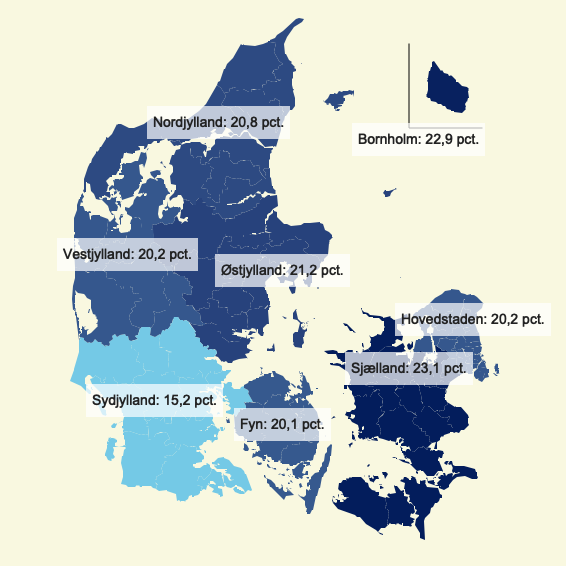

<!-- README.md is generated from README.Rmd. Please edit that file -->

# fmkort

<!-- badges: start -->

<!-- badges: end -->

Denne pakke indeholder funktioner, som kan lave danmarkskort i et
layout, som passer til Finansministeriets skabeloner. Koden i pakken er
kraftigt inspireret af
[leafletDK](https://github.com/mikkelkrogsholm/leafletDK) af [Mikkel
Krogsholm](https://github.com/mikkelkrogsholm).

Pakken indenholder pt følgende funktioner:

  - lave danmarkskort med cirkler ud fra koortinater med `fmcirkelkort`

Alle er velkommen til at bidrag til pakken funktionalitet ved at komme
med forslag til forberinger og nye fuktioner/features eller endnu bedre
ved at selv at udvikle på eksisterende funktioner eller ny funktioner.
Lave en pull request eller et issue på GitHub, skriv til min mail
(<auefl@fm.dk>) eller stik hovedet forbi.

## Installation

Du kan installere fmkort-pakken fra GitHub ved at køre følgende kode i R

``` r
# install.packages("devtools")
devtools::install_github("August-Emil/fmkort")
```

Det kan være nødvendigt at genstarte R efter installationen
(<kbd>shift</kbd> + <kbd>cmd</kbd> + <kbd>F10</kbd> på mac eller
<kbd>shift</kbd> + <kbd>crlt</kbd> + <kbd>F10</kbd> på Windows).

## Funktioner

Nedenfor gives en række eksempler på funktionerne i pakken. Alt data og
alle figurer kan findes i mappen `man/examples`

``` r
library(fmkort)
```

### Kort med cirkler

Funktionen `fmcirkelkort` laver et kort med cirkler, som har en givet
radius. Cirklernes placering bestemmes ud fra længe- og breddegrader,
mens cirklernes radius enten kan bestemmes som en fast størrelse (fx
`radius=30`) eller ud fra en kolonne i ens data (fx `radius="km"`).

``` r
load("man/examples/sygeplejerskeuddannelser.Rda")
fmcirkelkort(data = sygeplejerskeuddannelser, lon = "laengdegrad", lat = "breddegrad", radius = "km", color = "status", legend = T, dot = F, alpha = 0.8)
```

<!-- -->

### Kommunekort

Funktionen `fmkommunekortkort` laver et danmarkskort hvor kommunerner
fyldes ud med en farve med en tilsvarende værdi. Dette kan fx være
arbejdsløsheden. Farveskalen kan enten være numerisk (flydende), opdelt
i ‘bins’ eller efter kategorier (typsik hvis værdien ikke er nurmerisk,
fx borgmesterens parti.)

``` r
load("man/examples/arblos_kom.Rda")
fmkommunekort(data = arblos_kom, id = "kommune", value = "arblos", legend = T, legendtitle = "Arbjedsløshed", scale = 'bin.num')
```

<!-- -->

### RAR-kort

Funktionen `fmrarkort` laver et danmarkskort hvor de regionale
arbejdsmarkedsråd (RAR) fyldes ud med en farve med en tilsvarende værdi.
Dette kan fx være den forgæves rekretteringsrate Funktionen kan lave
markers/labels som angiver værdien for RAR-området. Derudover har
funktionen de samme funktionaliteter som `fmkommunekort`

``` r
load("man/examples/rardata.Rda")
fmrarkort(data = rardata, id = "omraade", value = "value", suffix = "pct.")
```

<!-- -->

### Regionskort

Funktionen `fmregionkort` har samme funktionaliteter som `fmrarkort`
blot for en anden geografisk inddeling.

``` r
load("man/examples/middellevetid.rda")
fmregionkort(data = middellevetid, id = "Region", value = "value", suffix = "år")
```

<!-- -->
